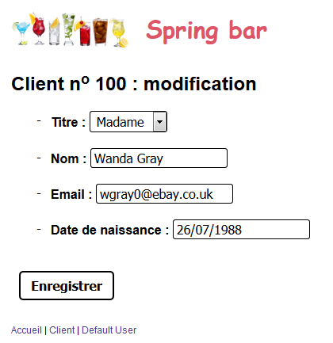
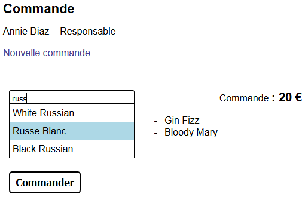
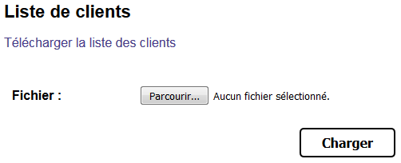

# Introduction à Spring MVC

:arrow_forward: [Diaporama](http://wehdrc.pages.innovation.insee.eu/formation-spring-mvc-v2)

:bookmark_tabs: [Imprimer](http://wehdrc.pages.innovation.insee.eu/formation-spring-mvc-v2/?print-pdf#/) (avec Chrome)

## Table des matières

* [1. Mise en place](README.md#1-mise-en-place)
* [2. Navigation](README.md#2-navigation)
* [3. Intercepteurs](README.md#3-intercepteurs)
* [4. Formulaires](README.md#4-formulaires)
* [5. Validation](README.md#5-validation)
* [6. Ajax](README.md#6-ajax)
* [7. Exceptions](README.md#7-exceptions)
* [8. Tests](README.md#8-tests)
* [9. Tiles](README.md#9-tiles)
* [10. Pour aller plus loin](README.md#10-pour-aller-plus-loin)

## 0. Récupérer le code source du TP

### Cloner le dépot Git

> Terminal

Dans le *workspace* :

```bash
git clone -b tp1 ssh://git@git.stable.innovation.insee.eu:22222/wehdrc/formation-spring-mvc-v2.git
cd formation-spring-mvc
```

### Importer le projet dans Eclipse

> Eclipse

* File
* Import…
* Existing Maven Project
* Root directory : D:\idep\Mes Documents\eclipse_workspace\formation-spring-mvc
* Finish

### Optimiser le processus développements

Ajouter les « Spring dev-tools » :

> pom.xml

```
<dependency>
	<groupId>org.springframework.boot</groupId>
	<artifactId>spring-boot-devtools</artifactId>
	<optional>true</optional>
</dependency>
```

Ajouter l’extension [RemoteLiveReload](https://chrome.google.com/webstore/detail/remotelivereload/jlppknnillhjgiengoigajegdpieppei?hl=fr-FR) et l’activer sur la page `http://localhost:8080`.

Installer la « Spring Tool Suit » en cherchant `sts` dans le *Eclipse Marketplace*.

## 1. Mise en place

```bash
git checkout -b tp1 origin/tp1
```

### Configurer le chemin d’accès aux pages

> application.properties

```properties
spring.mvc.view.prefix=/WEB-INF/views/
spring.mvc.view.suffix=.jsp
```

### Créer le package contenant les contrôleurs

> fr.insee.springmvc.controller

### Créer le contrôleur

> AccueilController.java

Ajouter l’annotation `@Controller`.
Créer une méthode qui retourne la vue `accueil` quand on accède à l’URL `/accueil`.
Cette méthode ajoute au modèle un objet `message` de type qui vaut `"Hello world"`.

### Créer une JSP qui affiche le message

> accueil.jsp

Éditer la JSP `accueil.jsp` dans le répertoire `/WEB-INF/views/` et afficher l’objet `message`.

```jsp
<%@ taglib prefix="c" uri="http://java.sun.com/jsp/jstl/core"%>
<h1><c:out value="${message}" /></h1>
```

Pour tester, exécuter la méthode `main` de la classe `SpringMvcApplication` puis se rendre à l’adresse `http://localhost:8080/accueil` dans un navigateur.

### Utiliser un fichier de propriétés

> src/main/resources/application.properties

```properties
welcome.message=Spring MVC
```

> AccueilController.java

Ajouter un attribute de type `String` dans le contrôleur et l’annoter avec `@Value("${welcome.message}")` pour récupérer la valeur de la clé `welcome.message`.
Paramétrer le message avec cet attribut.

Tester.

### Afficher la page d’accueil lorsque l’url racine est appelée

> AccueilController.java

Faire en sorte que l’URL racine `/` retourne également la page d’accueil.

Tester en avec l’URL `http://localhost:8080` dans le navigateur.

```bash
git add .
git commit -m "TP1"
git checkout -b solution-tp1 origin/solution-tp1
```

## 2. Navigation

> Terminal

```bash
git checkout -b tp2 origin/tp2
```

### Liste de tous les clients

#### Créer un contrôleur qui permet d’afficher la liste de tous les clients

> ClientsController.java

Ce contrôleur possède une méthode qui est appelée à l’URL « /clients ».
Il récupère la liste de tous les clients dans la base de donnée et l’ajoute au modèle.

```java
	@Autowired
	private ClientRepository clientRepository;
	…
	List<Client> clients = clientDao.findAll();
```

Il lance la génération de la vue `/views/clients.jsp`.

#### Afficher la liste des clients

> clients.jsp

En itérant sur la liste des clients avec le tag `<c:forEach>`, afficher la liste de tous les clients (nom et email) dans un tableau :

> Rappel : structure d’un tableau HTML

```html
	<table>
		<tr> <!-- Ligne entête -->
			<th>Entête 1</th>
			<th>Entête 2</th>
			<th>Entête 3</th>
		</tr>
		<tr> <!-- Ligne 1 -->
			<td>Cellule 1.1</td>
			<td>Cellule 1.2</td>
			<td>Cellule 1.3</td>
		</tr>
		<tr> <!-- Ligne 2 -->
			<td>Cellule 2.1</td>
			<td>Cellule 2.2</td>
			<td>Cellule 2.3</td>
		</tr>
	</table>
```

#### Ajouter un lien vers la page d’accueil

> clients.jsp

Grace au tag `<c:url>` créer une variable qui pointe vers la page d’accueil.
Utiliser cette variable dans un lien qui redirige vers la page d’accueil.

#### Sur la page d’accueil, ajouter un lien vers la page de la liste des clients

> accueil.jsp

### Détails pour un client donné

#### Créer un contrôleur qui permet d’afficher les informations concernant un client donné

> ClientController.java

Ce contrôleur possède une méthode qui est appelée à l’URL « /client/{id} ».
À l’aide de l’annotation `@PathVariable`, récupérer la valeur de l’identifiant passé dans l’URL.
Dans la base, récupérer le client associé à cet identifiant.
Ajouter le client au modèle.
Diriger vers la page `/views/client.jsp`.

#### Créer la page client.jsp

> client.jsp

Y afficher les informations relatives au client : identifiant, nom, email et date de naissance.
Pour formater la date, utiliser le tag `<fmt:formatDate>` et le format `dd/MMMM/yyyy`.
Ajouter un lien vers la page d’accueil.

#### Faire le lien entre la page clients et les sous-pages client

> clients.jsp

Autour de chaque nom de client, ajouter un lien qui pointe vers l’URL `/client/{id}`.
De cette manière, l’utilisateur peut cliquer sur le nom d’un client pour en voir le détail.

### Utilisation d’un convertisseur

#### Créer le nouveau convertisseur

> ClientConverter.java

Dans  le package `fr.insee.springmvc.converter`, créer une classe `ClientConverter` qui implémente de l’interface `Converter<String, Client>`.
Ne pas oublier le stéréotype `@Component` sur la classe.
Implémenter la méthode `convert` avec un appel à `clientDao.find(id)`.

#### Simplifier le contrôleur

> ClientController.java

Modifier la signature de la méthode pour remplacer le `Long` par un `Client`.
Supprimer le DAO du contrôleur.

Tester que l’application fonctionne toujours.

```bash
git add .
git commit -m "TP2"
git checkout -b solution-tp2 origin/solution-tp2
```

## 3. Intercepteurs

```bash
git checkout -b tp3 origin/tp3
```

### Créer un intercepteur qui mesure la durée de la requête

> TimerInterceptor.java

Implémenter l’interface `HandlerInterceptor`, et annoter la classe avec le stéréotype `@Component`.
Démarrer un chronomètre (`Stopwatch` de la librairie Guava) dans la méthode `preHandle`.
Enregistrer ce chronomètre en tant qu’attribut de la requête.
Dans la méthode `postHandle`, imprimer dans la console l’URI de la requête et le temps écoulé.

### 3.2. Enregistrer l’intercepteur

> SpringMvcConfiguration.java

Injecter l’intercepteur et l’ajouter au registre en surchargeant la méthode `addInterceptors`.
Penser à exclure les URL commençant par « /static », car sinon on passe aussi dans l’intercepteur pour le fichier CSS.

```java
registry.addInterceptor(it)
	.addPathPatterns("/**")
	.excludePathPatterns("/static/**")
```

### Placer l’utilisateur connecté en session

> UtilisateurInterceptor.java

Créer et enregistrer un intercepteur `UtilisateurInterceptor`.
Implémenter l’interface `HandlerInterceptor`, et annoter la classe avec le stéréotype `@Component`.
Dans l’intercepteur, essayer de récupèrer l’utilisater connecté dans la session.
S’il n’y a pas d’utilisateur dans la session, le créer à partir du jeton Keycloak et l’ajouter à la session :

```java
var securityContext = (KeycloakSecurityContext) request.getAttribute(KeycloakSecurityContext.class.getName());
if(securityContext != null) {
	var token = securityContext.getToken();
	utilisateur = Utilisateur.fromToken(token);
	...
}
```


### Créer une nouvelle page qui permet d’afficher l’utilisateur connecté

> accueil.jsp

Sur la page d’accueil, afficher le nom de l’utilisateur connecté dans le lien en bas de la page. Pour cela le récupérer en session :

```jsp
${sessionScope.utilisateur.nom}
```

> UtilisateurController.java

Créer un nouveau contrôleur qui dirige vers la page `/WEB-INF/views/utilisateur.jsp`.
Dans ce contrôleur, il faut récupérer l’utilisateur en session et l’ajouter au modèle.

### Créer et déclarer un résolveur d’argument pour la classe `Utilisateur`

> UtilisateurResolver.java

Implémenter l’interface `HandlerMethodArgumentResolver`, et annoter la classe avec le stéréotype `@Component`.
Dans la méthode `resolveArgument`, récupérer l’objet `Utilisateur` qui est dans la session.

> SpringMvcConfiguration.java

Injecter le résolveur d’argument et l’ajouter à la liste des résolveurs en surchargeant la méthode `addArgumentResolvers`.

> UtilisateurController.java

Finalement, remplacer l’object `HttpSession` par un object `Utilisateur` dans la signature de la méthode. Spring va désormais utiliser le résolveur d’argument.

### Tester

Exécuter les tests unitaires.
Puis lancer l’application et tester la navigation.

```bash
git add .
git commit -m "TP3 <idep>"
git checkout -b solution-tp3 origin/solution-tp3
git pull
```

## 4. Formulaires

```bash
git checkout -b tp4 origin/tp4
```

### Créer un contrôleur qui permet d’aller sur la page de modification d’un client

> ModificationClientController.java

Dans un premier temps, il faut une seule méthode associée à l’URL `GET /client/{id}/modification`
 - dans laquelle le client correspondant à la variable `{id}` est ajouté au modèle ;
 - et qui dirige vers le formulaire d’ajout d’un nouveau client : `modification-client.jsp`.

> client.jsp

Ajouter un lien qui permet d’accéder au formulaire de modification du client
```jsp
<a href="<c:url value="/client/${client.id}/modification" />">Modification</a>
```

#### Créer la page qui permet de modifier un client

> modification-client.jsp

Ne pas oublier la bibliothèque de balise nécessaires pour les formulaires :
```jsp
<%@ taglib prefix="form" uri="http://www.springframework.org/tags/form" %>
```

La page doit comprendre un formulaire `<form:form>` qui servira à poster les données, ce formulaire sera pré-rempli avec les données de la base :
```jsp
<form:form action="/client/${client.id}/modification" modelAttribute="client">
```
La balise doit contenir un attribut `modelAttribute` contenant le client vide.
Le formulaire possède les éléments suivants :

 - un menu déroulant (`<form:select>` contenant un `<form:options />`) pour le titre (Monsieur ou Madame) ;
 - un champ de texte pour le nom ;
 - un champ de texte pour l’adresse email ;
 - un champ de texte pour la date de naissance au format *jj/mm/aaaa* ;
 - un bouton « Enregistrer » qui poste les données du formulaire vers le serveur (`<button type="submit">`).



#### Enregistrer les modifications en base de données

> ModificationClientController.java

Ajouter une nouvelle méthode associée à l’URL `POST /client/{id}/modification` qui prend en paramètre deux objets de type `Client` :
 - un en provenance de la base de donnée, annoté `@PathVariable`
 - et un autre en provenance du formulaire, annoté `@ModelAttribute`

:question: Pour que le format de la date soit bien pris en compte par Spring MVC, penser à ajouter une annotation `@DateTimeFormat(pattern = "dd/MM/yyyy")` dans la classe `Client` sur le champ `dateNaissance`.

Injecter les instance des classe `ClientRepository` et `ClientService` dans le contrôleur.
 - Utiliser la méthode `updateWith` de la classe `ClientService` pour mettre à jour le client issu de la base à partir du client issu du formulaire avec la méthode.
 - Sans contrôles préalables, utiliser la méthode `save` de la classe `ClientRepository` pour enregistrer les modifications du client en base.

Rediriger vers la page du client :
```java
return "redirect:/client/{id}"
```

#### Afficher un message sur la page du client mis à jour

> ModificationClientController.java

Ajouter un paramètre de type `RedirectAttributes` au contrôleur associé à la requête `POST /client/{id}/modification`.
Lui ajouter un *flashAttribute* nommé `"modification"` et valant `true` de manière à pouvoir y accéder après la redirection.

> client.jsp

Si un un booléen `modification` est accessible dans le modèle, afficher le message : « Le client a été modifié avec succès » avec la class CSS `class="success"`.

```bash
git add .
git commit -m "TP4 <idep>"
git checkout solution-tp4
```


## 5. Validation

```bash
git checkout tp5-enonce
git pull
```

### 5.1. Validation élémentaire des objets de la classe `Client`

#### 5.1.1. Ajouter les dépendances nécessaires

> pom.xml

```xml
<dependency>
    <groupId>javax.validation</groupId>
    <artifactId>validation-api</artifactId>
    <version>1.1.0.Final</version>
</dependency>
<dependency>
    <groupId>org.hibernate</groupId>
    <artifactId>hibernate-validator</artifactId>
    <version>5.3.1.Final</version>
</dependency>
```

#### 5.1.2. Annoter la classe `Client`

> Client.java

Les règles sont les suivantes :
 * l’identifiant doit être positif,
 * la taille du nom doit être compris entre 5 et 30 caractères,
 * l’email doit correspondre au patron suivant :  `[-_a-z0-9.]+@[-_a-z0-9]+\.[a-z]{2,4}`,
 * le titre doit être non nul,
 * la date doit être non nulle et située dans le passé.

#### 5.1.3. Valider l’objet client dans le contrôleur de modification d’un client

> ModificationClientController.java

Déclencher la validation de l’objet client posté grace à l’annotation `@Valid`.
Stocker le résultat de cette validation dans un objet de type `BindingResult`.
Si l’objet n’est pas valide, renvoyer vers le formulaire de modification d’un client.
Le formulaire devra être rempli avec les dernières données saisies par l’utilisateur.

#### 5.1.4. Afficher les éventuelles erreurs de validation

> modification-client.jsp

Sous chaque champ du formulaire, ajouter la balise `<form:errors>` appropriée.
On pourra utiliser l’attribut `cssClass="error"` pour avoir mieux voir les messages d’erreurs.
Faire quelques tests pour vérifier que la validation fonctionne comme souhaité.
Essayer par exemple avec une date dont le format n’est pas bon.

#### 5.1.5. Personaliser les messages d’erreurs de validation

> dispatcher-servlet.xml

Ajouter une source de message internationalisée :

```xml
<bean id="messageSource" class="org.springframework.context.support.ResourceBundleMessageSource">
    <property name="basenames">
        <list>
            <value>message</value>
        </list>
   </property>
    <property name="defaultEncoding" value="UTF-8" />
</bean>
```

Déclarer cette source de message auprès d’un validateur :

```xml
<bean id="validator" class="org.springframework.validation.beanvalidation.LocalValidatorFactoryBean">
    <property name="validationMessageSource" ref="messageSource"/>
</bean>
```

Déclarer le validateur auprès de Spring MVC :

```xml
<mvc:annotation-driven conversion-service="conversionService" validator="validator">
```

> message_fr.properties

En suivant les règles de nommage des clés, écrire des messages pour chaque erreur de validation possible.
Par exemple :

```properties
NotNull.client.titre=Choisir un titre
```

:exclamation: Ne pas oublier le message d’erreur de conversion de la date.

Tester.

### 5.2. Vérifier que l’email du client n’est pas déjà utilisé

#### 5.2.1. Créer un validateur qui vérifie l’unicité de l’email

> ClientValidator.java

Utiliser la fonction `ClientService.emailDejaUtilise` pour faire le contrôle.
En cas d’erreur, le message à afficher est défini par sa clé dans le fichier message_fr.properties.
Pour cela, utiliser la fonction`Errors.rejectValue(String field, String errorCode)` et ajouter une ligne correspondant à `errorCode` dans le fichier de messages.

#### 5.2.2. Utiliser le nouveau validateur dans le contrôleur

> ModificationClientController.java

Injecter le validator dans le contrôleur grâce à l’annotation `@Autowired`.

### 5.3. Ajouter les contrôles au formulaire de création d’un nouveau client.

> nouveau-client.jsp, NouveauClientController.java

```bash
git add .
git commit -m "TP5 <idep>"
git checkout tp5-correction
git pull
```

## 6. Ajax

```bash
git checkout tp6-enonce
git pull
```



### 6.1. Créer un contrôleur qui permet de passer une nouvelle commande

> CommandeController.java, accueil.jsp

Ce contrôleur récupère l’employé connecté (*cf.* TP3), l’ajoute au modèle et dirige vers la page existante `commande.jsp`.
Ajouter un lien vers cette page sur la page d’accueil.

### 6.2. Créer un contrôleur qui permet de rechercher un cocktail

> CocktailController.java

En fonction d’une chaîne de caractère `q`, le contrôleur recherche dans la liste des cocktails ceux qui correspondent.
La chaine de caratère `q` est passée en paramètre de la requête et récupérée dans le contrôleur avec annotation `@RequestParam`.
Pour trouver la liste des suggestions correspondant au paramètre `q`, utiliser la méthode `CocktailDao.search`.
Le contrôleur retourne la liste JSON des cocktails suggérés grâce à l’annotation `@ResponseBody`.

:exclamation: Ne pas oublier d’ajouter la librairie Jackson au classpath :

```xml
<dependency>
	<groupId>com.fasterxml.jackson.core</groupId>
	<artifactId>jackson-databind</artifactId>
	<version>2.8.4</version>
</dependency>
```

Tester l’appel à cette fonction en tapant l’URL dans le navigateur : `http://localhost/cocktails/recherche?q=russ`.

### 6.3. Déclencher la recherche d’un cocktail

> recherche.js

Écrire le corps de la fonction `rechercher`.
Cette fonction est appelée à chaque fois que l’utilisateur appuie sur une touche dans le champ de recherche.

La fonction doit faire un appel Ajax vers le contrôleur de recherche d’un cocktail :

 * vers l’URL `/cocktails/recherche`
 * avec la méthode `GET`,
 * et le paramètre `q` URL encodé.

Elle reçoit en retour une liste de cocktails.
Dans la fonction `done`, appeler  la fonction `afficherSuggestions` avec en paramètre la liste de cocktails.

:question: On peut ajouter un coktail de la liste de suggestions en cliquant dessus, on peut ensuite le retirer en cliquant sur dessus dans la liste de droite.

### 6.2. Créer un contrôleur qui permet de calculer le montant d’une commande

> CocktailController.java

Ce contrôleur prend en paramètre une liste de cocktail qui sera postée en Ajax grâce à l’annotation `@RequestBody`.
Dans cette liste, les objets cocktails sont incomplets, il ne possèdent qu’un identifiant.
Utiliser la méthode `CocktailDao.findByExample` pour récupérer leur prix.
En faire la somme et retourner le résultat tel quel.

:question: C’est l’occasion idéale d’utiliser les fonctionnalités de Java 8 : *stream*, *map / reduce* et *method reference*.

### 6.3. Déclencher la commande d’une liste de cocktails

> recherche.js

Écrire le corps de la fonction `commander`.
Cette fonction est appelée à chaque fois que l’utilisateur appuie sur le bouton « Commander ».

La fonction doit faire un appel Ajax vers le contrôleur de recherche d’un cocktail :

 * vers l’URL `/cocktails/commande`
 * avec la méthode `POST`,
 * et en paramètre, la liste des cocktails sélectionnés sous forme d’une chaine de caractère représentant du JSON.

Elle reçoit en retour le prix de la commande.
Dans la fonction `done`, appeler  la fonction `afficherPrix` avec en paramètre le prix.

Tester que tout fonctionne.

```bash
git add .
git commit -m "TP6 <idep>"
git checkout tp6-correction
git pull
```

## 7. Exceptions

```bash
git checkout tp7-enonce
git pull
```

### 7.1. Vérifier que seul un responsable peut modifier ou créer un nouveau client

#### 7.1.1. Créer une nouvelle exception `BarDroitException`

> BarDroitException.java

La faire hériter de `BarException` au travers de `BarHttpException`.

#### 7.1.2. Créer une méthode qui vérifie que l’employé est un responsable

> EmployeService.java

La nouvelle méthode doit lever une exception de type `BarDroitException` si l’employé n’est pas un responsable.

#### 7.1.3. Réaliser cette vérification dans les contrôleurs

> NouveauClientController.java, ModificationClientController.java

Utiliser cette méthode dans les deux contrôleurs de création et de modification d’un client.

#### 7.1.4. Créer un contrôleur qui traite cette exception

> ExceptionController.java

Annoter ce contrôleur `ControllerAdvice`. Écrire une méthode qui est appelée dès qu’une exception de type `BarDroitException` est levée. Ce contrôleur dirige vers une JSP appelée `exception.jsp`. Cette JSP devra afficher le message d’erreur de l’exception.
Le contrôleur doit en plus retourner un code HTTP 403 (Forbidden).

#### 7.1.5. Créer une page d’erreur

> exception.jsp

Dans la nouvelle JSP, afficher le message d’erreur de l’exception.

#### 7.1.6. Modifier le profile pour pouvoir vérifier que le contrôle fonctionne

> web.xml

Remplacer `responsable` par `serveur`.

### 7.2. Vérifier qu’une commande comporte au moins un cocktail

#### 7.2.1. Créer une nouvelle exception `BarCommandeException`

> BarAjaxException.java

La faire hériter de `BarException` au travers de `BarAjaxException`.

#### 7.2.2. Créer une méthode qui vérifie qu’une commande n’est pas vide

> CocktailService.java

La nouvelle méthode doit lever une exception de type `BarCommandeException` si la commande ne contient pas de cocktail.

#### 7.2.3. Réaliser cette vérification dans le contrôleur

> CocktailControlleur.java

#### 7.2.4. Créer un contrôleur qui traite cette exception

> ExceptionController.java

Écrire une méthode qui est appelée dès qu’une exception de type `BarCommandeException` est levée. Le contrôleur doit en plus retourner un code HTTP 400 (Bad request) et le message d’erreur dans un objet `ResponseEntity`.

#### 7.2.5. Afficher une erreur si la commande est passée sans contenir aucun cocktail

> recherche.js

Ajouter un *callback* `fail` en cas d’erreur. Dans ce *callback*, faire appel à la fonction `afficherErreur` avec le message d’erreur;

### 7.3. Traiter les erreurs 404 grâce à Spring MVC

#### 7.3.1. Configurer la servlet dans le fichier web.xml

> web.xml

```xml
<init-param>
	<param-name>throwExceptionIfNoHandlerFound</param-name>
	<param-value>true</param-value>
</init-param>
```

#### 7.3.2. Rediriger vers une page d’erreur

> ExceptionController.java

Ajouter un contrôleur qui intercepte l’exception `NoHandlerFoundException` et qui redirige vers une page d’erreur avec le message « La page que vous cherchez n’existe pas. » et un code HTTP 404.

Tester en saisissant une URL qui n’existe pas dans la barre d’adresse.

```bash
git add .
git commit -m "TP7 <idep>"
git checkout tp7-correction
git pull
```

## 8. Tests

```bash
git checkout tp8-enonce
git pull
```

### 8.1. Ajouter les librairies nécessaires aux différents tests

> pom.xml

```xml
<dependency>
	<groupId>junit</groupId>
	<artifactId>junit</artifactId>
	<version>4.12</version>
	<scope>test</scope>
</dependency>
<dependency>
	<groupId>org.mockito</groupId>
	<artifactId>mockito-all</artifactId>
	<version>1.10.19</version>
	<scope>test</scope>
</dependency>
<dependency>
    <groupId>org.springframework</groupId>
    <artifactId>spring-test</artifactId>
    <version>${spring.version}</version>
    <scope>test</scope>
</dependency>
<dependency>
   <groupId>org.glassfish.web</groupId>
   <artifactId>javax.el</artifactId>
   <version>2.2.4</version>
   <scope>test</scope>
</dependency>
```

### 8.2. Écrire des tests unitaires

Écrire des tests pour les méthodes de `AccueilController` et pour les méthodes `NouveauClientController`.

Ajouter les imports statiques suivants pour avoir accès aux assertions :

```java
import static org.springframework.test.web.servlet.request.MockMvcRequestBuilders.*;
import static org.springframework.test.web.servlet.result.MockMvcResultMatchers.*;
```

#### 8.2.1 Préparer les tests de `AccueilController`

> AccueilControllerTest.java

#### 8.2.2 Tester la méthode welcome()

 * tester que le status est 301,
 * tester qu l’attribut `message` n’existe pas dans le modèle.

#### 8.2.3 Tester la méthode hello()

 * tester que le status est 200,
 * tester que l’attribut `message` existe dans le modèle,
 * tester que le nom de la vue est `accueil`.

#### 8.2.4 Préparer les tests de `NouveauClientController`

> NouveauClientControllerTest.java

#### 8.2.5 Tester la méthode nouveauClientPost() pour un formulaire valide

 1. Exécuter un POST avec en paramètre des données de formulaire valides
 2. Puis tester que :
  * le status est 302,
  * l’attribut client n’existe pas,
  * le modèle ne contient aucune erreur,
  * l’url de redirection est `/clients`,
  * il existe un attribut flash qui s’appelle `nouveauClient`.

#### 8.2.5 Tester la méthode nouveauClientPost() pour un formulaire non valide

 1. Exécuter un POST avec en paramètre des données de formulaire valides sauf pour l’email
 2. Puis tester que :
  * le status est `OK`,
  * l’attribut client existe,
  * le modèle contient une erreur,
  * le nom de la vue est `nouveau-client`.

Finalement, tester la méthode associée à l’URL `/client/nouveau` pour un profile "serveur".

```bash
git add .
git commit -m "TP8 <idep>"
git checkout tp8-correction
git pull
```

## 9. Tiles

```bash
git checkout tp12-enonce
git pull
```

### 9.1 Installation de Tiles

#### 9.1.1 Ajouter les dépendances Maven

> pom.xml

```xml
<dependency>
    <groupId>org.apache.tiles</groupId>
    <artifactId>tiles-extras</artifactId>
    <version>3.0.7</version>
</dependency>
```

#### 9.1.2 Remplacer le view resolver

> dispatcher-servlet.xml

```xml
<bean id="viewResolver" class="org.springframework.web.servlet.view.tiles3.TilesViewResolver"/>
<bean id="tilesConfigurer" class="org.springframework.web.servlet.view.tiles3.TilesConfigurer">
    <property name="definitions">
        <list>
            <value>/WEB-INF/views/tiles.xml</value>
        </list>
    </property>
</bean>
```

### 9.2 Nouvelle arborescence

Dans `/WEB-INF/views/` :

 1. créer un répertoire `pages/` et y déplacer les JSP,
 2. créer un répertoire `layouts/` contenant un fichier `default-layout.jsp`,
 3. créer un répertoire `template/` contenant deux fichiers, `default-footer.jsp` et `default-header.jsp`.

### 9.3 Template principal

> default-layout.jsp

Copier le contenu de `commande.jsp` dans `default-layout.jsp`.

Ajouter la taglib Tiles :
```jsp
<%@ taglib prefix="tiles" uri="http://tiles.apache.org/tags-tiles" %>
```

Puis, remplacer le contenu du `<body>`, par trois sections : `<header>`, `<section>` et `<footer>`.

Y ajouter les attributs Tiles suivants : `"header"`, `"body"` et `"footer"`.

À la place du contenu de la balise `<title>`, ajouter l’attribut textuel "title".

### 9.4 Simplification des JSP

> commande.jsp

Le code contenu dans `default-layout.jsp` étant désormais valable pour toutes les pages, il faut le supprimer des JSP du répertoire `pages/`.
Ce travail a été fait sauf pour la page `commande.jsp`.

### 9.5 Création du header

> default-header.jsp

Dans le header, ajouter l’image `webapp/static/cocktails.png` et un titre `<h1>` qui sera le nom du bar.

### 9.6 Création du footer

> default-footer.jsp

Dans le footer, ajouter un lien vers la page d’accueil.

### 9.7 Création des pages avec Tiles

> tiles.xml

#### 9.7.1 Définition de base

Définir d’abord une `<definition>` de base appelée "base-definition" et pointant vers la page `default-layout.jsp`.
Ce layout contient quatre attributs appelés `title`, `header`, `body` et `footer`.
Les attributs header et footer sont non vides et pointent respectivement vers `default-header.jsp` et `default-footer.jsp`.

#### 9.7.2 Définition de la page d’accueil

Définir ensuite une `<definition>` appelée "accueil" et héritant de "base-definition".
Valoriser les attributs `title`, `body` et `footer`.
Pour la page d’accueil, le footer doit être vide car on ne veut pas de lien vers la page d’accueil sur la page d’accueil !

#### 9.7.3 Définition de la page de chargement des clients

Définir ici une `<definition>` appelée "chargement-clients" et héritant de "base-definition".
Valoriser les attributs `title` et `body`.

Finalement décommenter le reste du fichier pour faire fonctionner les autres pages.

```bash
git add .
git commit -m "TP12 <idep>"
git checkout tp12-correction
git pull
```

## 10. Pour aller plus loin

### 10.1. Configuration

```bash
git checkout tp9-enonce
git pull
```

Remplacer toute la configuration xml par de la configuration Java. Penser à adapter le ficihier `web.xml`. Supprimer les fichiers `applicationContext.xml` et `dispatcher-servlet.xml`.

```bash
git add .
git commit -m "TP9 <idep>"
git checkout tp9-correction
git pull
```

### 10.2. Transmettre et récupérer un fichier

```bash
git checkout tp10-enonce
git pull
```



Faire une nouvelle page à partir de laquelle un employé peut *uploader* une liste de clients au format CSV :

```csv
2;Sylvie Dupont;sylvie.dupont@email.com;25/12/1970
1;Thomas Dupond;thomas.dupond@monmail.fr;01/11/1981
```

Une fonction effectue les opération suivantes sur le fichier :

 * vérifie la validité de chaque ligne,
 * écrire les erreurs détectées dans la log,
 * insérer les lignes valides dans la base de donnée,
 * retourner le nombre total d’insertions.

Sur la même page, permettre à un employé de télécharger la liste complète des clients au format CSV.

```bash
git add .
git commit -m "TP10 <idep>"
git checkout tp10-correction
git pull
```

### 10.3. Autres types de vues

```bash
git checkout tp12-enonce
git pull
```

On veut maintenant pouvoir télécharger la liste des clients sous forme de fichier Excel ou PDF.

```bash
git add .
git commit -m "TP12 <idep>"
git checkout tp12-correction
git pull
```

